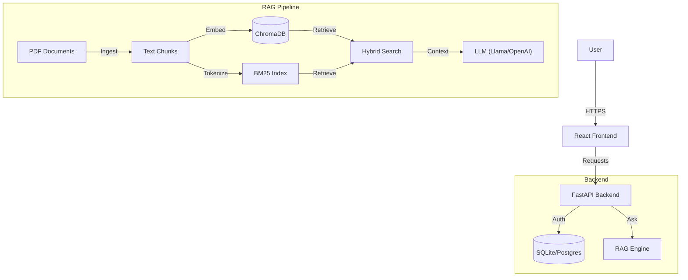

# RAG Copilot with Authentication

A full-stack AI Copilot application featuring Retrieval-Augmented Generation (RAG) for PDF knowledge bases, complete with user authentication, precision scoring, and a modern React frontend.


## Features

- **Document Q&A**: Upload PDFs and ask questions about them.
- **RAG Engine**: Hybrid search (BM25 + Semantic) for high-accuracy retrieval.
- **Precision Scoring**: Displays relevance scores (0-100%) and transparency for every answer.
- **Verification**: Refuses to answer if context is insufficient ("I don't have enough information").
- **Authentication**: JWT-based Signup and Login flows.
- **Modern UI**: Glassmorphism design using React and CSS modules.

## Architecture



## Quick Start / Quality Gate

Run the automated quality gate to verify the system:

**Windows (PowerShell)**:
```powershell
./scripts/test_all.bat
```

**Linux/Mac**:
```bash
make test
```

### Manual Setup
 **Backend**:
   ```bash
   cd backend
   pip install -r requirements.txt
   python -m uvicorn app.main:app --reload
   ```
 **Frontend**:
   ```bash
   cd frontend
   npm install
   npm run dev
   ```

## Live Deployment

### 🟢 Backend (Hugging Face Spaces)
- **Live URL**: [https://abiramavarshini-rag-backend.hf.space](https://abiramavarshini-rag-backend.hf.space)
- **Status**: Running 🚀

### 🔵 Frontend (Vercel)
- **Live URL**: [https://rag-copilot.vercel.app/](https://rag-copilot.vercel.app/)
- **Status**: Running 🚀

Anyone with this link can sign up, log in, and use the RAG copilot without any local setup.

## API Documentation

### Auth
- `POST /auth/signup`: Register a new user.
- `POST /auth/login`: Get access token.

### RAG
- `POST /rag/ingest`: Trigger PDF ingestion.
- `POST /rag/ask`: Ask a question.
  ```json
  {
    "query": "What is the policy on X?"
  }
  ```

## Ingestion & Evaluation
- **Ingestion**: PDFs in `backend/data/` are read, split into 150-word chunks with 30-word overlap, and indexed.
- **Evaluation**: We use a hybrid retrieval approach (Vector + Keyword) and verify answers by checking if retrieval scores exceed a 0.60 threshold.

